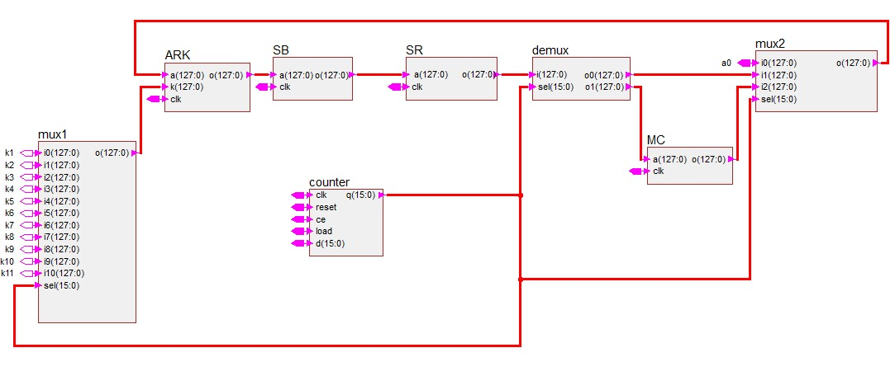
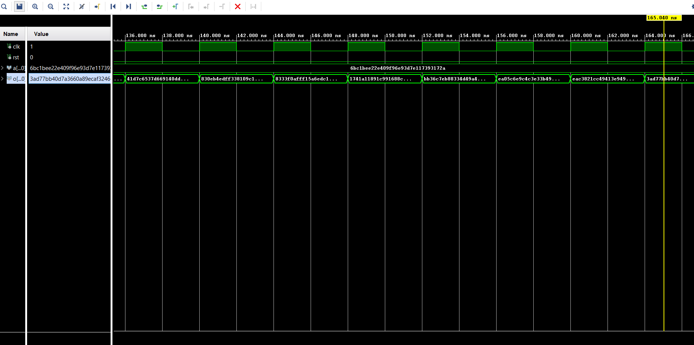
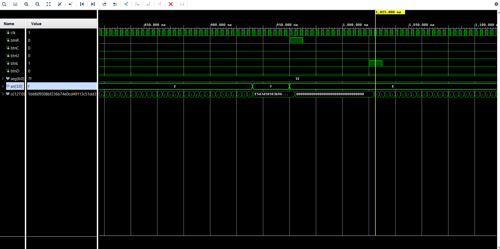

# AES-128 Encryption on FPGA

[](https://digilent.com/reference/programmable-logic/basys-3/start)
[](https://en.wikipedia.org/wiki/VHDL)
[](LICENSE)

FPGA implementation of the **AES-128 encryption algorithm** on the Basys 3 development board (Xilinx Artix-7).

---

## 📋 Overview

This project implements a complete AES-128 encryption engine in VHDL, featuring:
- **State machine-based control** for efficient round management
- **Optimized datapath** achieving 1 clock cycle per transformation
- **NIST-validated** implementation using official test vectors
- **Hardware interface** with button controls and 7-segment display

---

## ✨ Features

- ✅ Complete 10-round AES-128 encryption
- ✅ Modular design with separate components for each transformation
- ✅ Comprehensive testbenches for all modules
- ✅ Button-controlled operation on Basys 3 board
- ✅ Multiple test vector support (4 plaintexts)
- ✅ 7-segment display feedback ("AES" on completion)

---

## 🏗️ Architecture

The encryption engine consists of **4 main transformations**:

| Module | Function | Implementation |
|--------|----------|----------------|
| **AddRoundKey** | XOR with round key | Bitwise XOR operation |
| **SubBytes** | Byte substitution | S-box lookup table (256 entries) |
| **ShiftRows** | Row shifting | Cyclic byte rotation |
| **MixColumns** | Column mixing | Galois field GF(2⁸) multiplication |

### Block Diagram



*Complete AES-128 architecture showing datapath and control logic with feedback loop for 10 encryption rounds.*

### State Machine Flow
```
RESET → AddRoundKey → [SubBytes → ShiftRows → MixColumns → AddRoundKey] ×9 
     → SubBytes → ShiftRows → AddRoundKey → DONE
```

---

## 📂 Project Structure
```
AES-128-Encryption-FPGA/
├── src/                      # VHDL source files
│   ├── AddRoundKey.vhd      # Round key XOR
│   ├── SubBytes.vhd         # S-box substitution
│   ├── ShiftRows.vhd        # Row shifting
│   ├── MixColumn.vhd        # Column mixing
│   ├── StepsModules.vhd     # Integration module
│   ├── AES_encryption.vhd   # Top-level entity
│   ├── S_box.vhd            # S-box lookup table
│   ├── LUT_mul2.vhd         # GF(2⁸) multiplication by 2
│   └── LUT_mul3.vhd         # GF(2⁸) multiplication by 3
│
├── testbench/               # VHDL testbenches
│   ├── TB_AddRoundKey.vhd
│   ├── TB_SubBytes.vhd
│   ├── TB_ShiftRows.vhd
│   ├── TB_MixColomns.vhd
│   ├── TB_StepsModules.vhd
│   └── TB_AES_encryption.vhd
│
├── constraints/             # FPGA constraints
│   └── Basys-3-Master.xdc  # Basys 3 pin assignments
│
└── docs/                    # Documentation
    ├── AES_Project_Report.pdf
    ├── diagrams/            # Architecture diagrams
    └── waveforms/           # Simulation results
```

---

## 🚀 Getting Started

### Prerequisites

- Xilinx Vivado (2020.x or later)
- Basys 3 FPGA board (optional, for hardware testing)

### Simulation

1. **Clone the repository**
```bash
   git clone https://github.com/GlodiSala/AES-128-Encryption-FPGA.git
   cd AES-128-Encryption-FPGA
```

2. **Open Vivado and create a new project**
   - Add all files from `src/` as design sources
   - Add files from `testbench/` as simulation sources

3. **Run simulation**
   - Select desired testbench (e.g., `TB_AES_encryption`)
   - Run behavioral simulation
   - Verify outputs against expected NIST values

### Hardware Implementation

1. Add constraint file (`constraints/Basys-3-Master.xdc`)
2. Run synthesis and implementation
3. Generate bitstream
4. Program the FPGA via USB

### Board Controls

| Button | Function |
|--------|----------|
| `btnC` | Encrypt test vector #1 |
| `btnU` | Encrypt test vector #2 |
| `btnL` | Encrypt test vector #3 |
| `btnD` | Encrypt test vector #4 |
| `btnR` | Reset system |

*Note: Uncomment button pins in constraint file to enable all buttons.*

---

## 🧪 Validation

All modules validated using **NIST FIPS 197** test vectors:
- 128-bit plaintext inputs
- 128-bit cipher key
- Expected ciphertext outputs
- Intermediate round state verification

**Reference**: [NIST FIPS 197](https://csrc.nist.gov/publications/detail/fips/197/final)

### Simulation Results


*Complete AES encryption cycle showing input plaintext, round progression, and final ciphertext output.*


*Hardware control interface demonstration with button inputs and 7-segment display output.*

---

## 📊 Documentation

- **[Full Project Report](docs/AES_Project_Report.pdf)** - Complete technical documentation
- **[Block Diagrams](docs/diagrams/)** - System architecture
- **[Simulation Waveforms](docs/waveforms/)** - Testbench results

---

## 🛠️ Technologies

- **HDL**: VHDL
- **Tools**: Xilinx Vivado 2023.x
- **Target**: Basys 3 (Artix-7 XC7A35T-1CPG236C)
- **Validation**: NIST FIPS 197 test vectors

---

## 👥 Authors

**Glodi Sala Mangituka**  
📧 glodi.sala.mangituka@gmail.com  
🔗 [LinkedIn](https://linkedin.com/in/glodi-sala-mangituka)  
🐙 [GitHub](https://github.com/GlodiSala)

**Jian Huo**  
📧 jian.huo@ulb.be

---

## 🎓 Academic Context

**Course**: ELECH-409 - Digital Architectures and Design  
**Institution**: Université Libre de Bruxelles (ULB) / Vrije Universiteit Brussel (VUB)  
**Date**: December 2023

### Supervisors
- **Prof. Dragomir Milojevic** - Course Instructor
- **Oscar Van Slipje** - Teaching Assistant
- **Muhammad Ali** - Teaching Assistant

---

## 📜 License

This project is licensed under the MIT License - see the [LICENSE](LICENSE) file for details.

---

## 🙏 Acknowledgments

- ULB/VUB teaching staff for guidance and support
- NIST for AES specification and test vectors
- Digilent for Basys 3 documentation
- Xilinx for Vivado Design Suite

---

## 📚 References

1. [NIST FIPS 197: Advanced Encryption Standard](https://csrc.nist.gov/publications/detail/fips/197/final)
2. Daemen, J., & Rijmen, V. (2002). *The Design of Rijndael: AES - The Advanced Encryption Standard*
3. [Basys 3 Reference Manual](https://digilent.com/reference/programmable-logic/basys-3/reference-manual)

---

